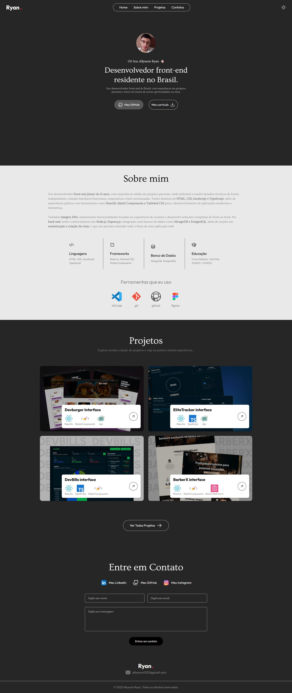

# Interface Portfolio 2.0

Aplicação frontend de um portfólio pessoal desenvolvida com foco em performance, responsividade e boas práticas de código. Este projeto se comunica com uma API para exibir informações de projetos, tecnologias e para envio de mensagens de contato.

## ✨ Funcionalidades

- Alternância entre tema claro e escuro
- Seções: Home, Sobre Mim, Projetos, Contato
- Exibição de até 4 projetos principais na Home
- Página com detalhes de cada projeto (consumo de API)
- Listagem de tecnologias com ícones (via API)
- Formulário de contato com envio para API externa

## 📦 Tecnologias Principais

- React
- TypeScript
- TailwindCSS
- Axios
- React Router DOM
- Static Forms (envio de formulários)
- Zustand ou Context API (gerenciamento de tema)
- SWR ou React Query (opcional para requisições)

## 🧱 Estrutura do Projeto

- `src/components` → Componentes reutilizáveis (botões, cards, header, etc.)
- `src/pages` → Páginas principais (Home, Sobre, Projetos, Contato)
- `src/services` → Configuração do Axios e chamadas à API
- `src/styles` → Estilização global e temas
- `src/sections` → Seções da Home (como "Sobre Mim", "Projetos em Destaque", etc.)
- `src/MainLayout` → Layout principal compartilhado entre as páginas (Header, Footer, Outlet do React Router)

## ⚙️ Como Executar o Projeto

1. Clone este repositório

```bash
git clone https://github.com/seu-usuario/interface-portfolio-2.0.git
cd interface-portfolio-2.0
```

2. Instale as dependências

```bash
npm install
```

3. Configure variáveis de ambiente do .env

4. Rode o projeto em ambiente de desenvolvimento

```bash
npm run dev
```

## 💡 Boas Práticas

- Código modular e limpo
- Separação clara de responsabilidades (componentes, páginas, serviços)
- Estilização com Tailwind utilizando variáveis de tema
- Consumo de APIs com Axios e fallback em erros
- Utilização de hooks e gerenciamento de estado moderno

# Screenshot

Aqui temos a captura de tela do projeto:

